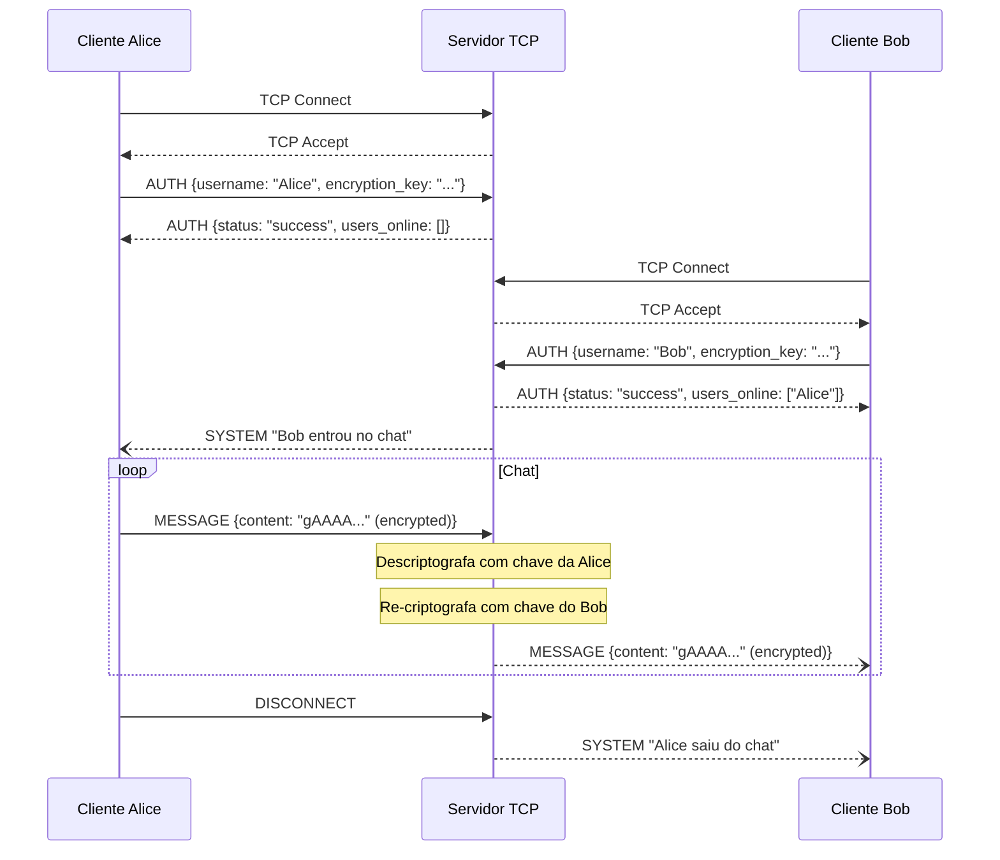

# 🔌 Chat TCP/IP com Criptografia

[](https://python.org)
[](LICENSE)
[](https://docker.com)
[](https://github.com/SEU-USUARIO/chat-tcp/actions)

Sistema **cliente-servidor de chat em tempo real** desenvolvido do zero com Sockets TCP/IP, criptografia Fernet (AES-128) e infraestrutura containerizada com Docker.

> 📚 Projeto da disciplina **Infraestrutura de Redes** — 5º Período de Engenharia de Software

---

## ✨ Funcionalidades

| Feature | Detalhe |
|---------|---------|
| 💬 **Chat em tempo real** | Múltiplos usuários simultâneos com broadcast de mensagens |
| 🔐 **Criptografia Fernet** | AES-128-CBC + HMAC-SHA256 por cliente |
| ✅ **Integridade** | Checksum SHA-256 em cada mensagem |
| 🔮 **Mensagens Diretas** | `/dm <usuario> <mensagem>` entre dois clientes |
| 🔄 **Reconexão automática** | Backoff exponencial (2s → 4s → 8s → ...) |
| 💓 **Keep-alive** | PING/PONG detecta desconexões silenciosas |
| 🛡️ **Graceful Shutdown** | CTRL+C notifica todos os clientes antes de encerrar |
| 📊 **Logs estruturados** | Formato JSON com rotação automática |
| 🐳 **Containerizado** | Docker + Docker Compose com healthcheck |
| 🤖 **CI/CD** | GitHub Actions com lint e testes automáticos |

---

## 🏗️ Arquitetura



### Componentes

```
src/
├── common/          # Código compartilhado entre cliente e servidor
│   ├── protocol.py  # Protocolo JSON + TCP framing (length-prefix)
│   ├── crypto.py    # CryptoManager — Fernet + checksum SHA-256
│   ├── config.py    # Configurações via variáveis de ambiente
│   ├── logger.py    # Logs estruturados em JSON
│   └── exceptions.py
├── server/
│   ├── server.py         # ChatServer — accept loop + graceful shutdown
│   ├── client_handler.py # Thread por cliente (auth + message loop)
│   ├── message_broker.py # Broadcast thread-safe com snapshot
│   └── auth.py           # Validação de username
└── client/
    ├── client.py              # ChatClient — threads de input e receive
    ├── ui.py                  # Interface colorida com colorama
    └── connection_manager.py  # Reconexão com backoff exponencial
```

### Por que TCP e não UDP?

TCP garante **entrega ordenada e confiável** — essencial para um chat onde a ordem das mensagens importa e nenhuma pode ser perdida. UDP seria mais rápido, mas exigiria implementar controle de fluxo manualmente.

### Por que Threading e não Asyncio?

Threading é mais didático para demonstrar concorrência e é mais legível para quem está aprendendo. Em produção com alta carga, `asyncio` seria mais eficiente (sem overhead de troca de contexto de SO).

### Por que Fernet e não RSA?

Fernet (criptografia simétrica) é mais simples de implementar e adequada ao escopo do projeto. RSA seria usado em um handshake para trocar a chave simétrica com segurança. Ver [Limitações de Segurança](#limitações-de-segurança).

---

## 🚀 Como Usar

### Pré-requisitos

- Python 3.11+
- Docker e Docker Compose (opcional)

### Instalação

**Windows:**
```bat
scripts\setup.bat
```

**Linux / macOS:**
```bash
chmod +x scripts/*.sh
./scripts/setup.sh
```

### Executando Localmente

**Terminal 1 — Servidor:**
```bash
# Windows
scripts\run_server.bat

# Linux/Mac
./scripts/run_server.sh

# Ou direto:
python -m src.server.server
python -m src.server.server --host 0.0.0.0 --port 5000
```

**Terminal 2, 3, ... — Clientes:**
```bash
# Windows
scripts\run_client.bat

# Linux/Mac
./scripts/run_client.sh

# Com argumentos:
python -m src.client.client --username Alice
python -m src.client.client --host meu-servidor.railway.app --port 5000
```

### Usando Docker 🐳

```bash
# Build e sobe servidor
docker-compose up server

# Em outro terminal, sobe cliente interativo
docker-compose run --rm client
```

---

## 💬 Comandos do Chat

| Comando | Descrição |
|---------|-----------|
| `<mensagem>` | Envia mensagem para todos |
| `/dm <usuario> <msg>` | Mensagem direta (privada) |
| `/users` | Lista usuários online |
| `/help` | Exibe ajuda |
| `/quit` | Desconecta e encerra |

---

## 📡 Protocolo

Todas as mensagens seguem o formato JSON com **length-prefix framing** (4 bytes big-endian):

```
┌──────────────────┬─────────────────────────────────────┐
│ 4 bytes (uint32) │ N bytes (JSON UTF-8)                 │
│ comprimento N    │ conteúdo da mensagem                 │
└──────────────────┴─────────────────────────────────────┘
```

Exemplo de mensagem:

```json
{
  "version": "1.0",
  "type": "MESSAGE",
  "timestamp": "2026-02-27T15:30:00.000Z",
  "sender": "Alice",
  "recipient": "all",
  "payload": {
    "content": "gAAAAABj8x9K3mR...",
    "encrypted": true
  },
  "checksum": "a1b2c3d4..."
}
```

Tipos de mensagem: `AUTH`, `MESSAGE`, `PING`, `PONG`, `DISCONNECT`, `USER_LIST`, `SYSTEM`, `ERROR`

Ver [docs/PROTOCOL.md](docs/PROTOCOL.md) para especificação completa.

---

## 🔐 Segurança

- **Algoritmo:** Fernet = AES-128-CBC + HMAC-SHA256 + timestamp
- **Chaves:** Geradas aleatoriamente (256 bits) por cliente na inicialização
- **Integridade:** SHA-256 calculado antes da criptografia, verificado após descriptografia
- **Anti-timing:** Comparação de checksums em tempo constante (evita timing attacks)

### Limitações de Segurança

> ⚠️ **Este é um projeto educacional.** As limitações abaixo são conhecidas e documentadas:
>
> 1. **Troca de chave sem proteção:** A chave Fernet trafega em texto plano na mensagem AUTH. Um atacante com acesso à rede pode interceptar e descriptografar as mensagens. A solução em produção seria TLS/SSL ou um handshake Diffie-Hellman.
>
> 2. **Autenticação por username apenas:** Não há senha ou certificado. Qualquer pessoa pode entrar com qualquer username disponível.

---

## 🧪 Testes

```bash
# Todos os testes com coverage
pytest tests/ -v --cov=src --cov-report=term-missing

# Apenas um módulo
pytest tests/test_crypto.py -v
pytest tests/test_protocol.py -v
pytest tests/test_server.py -v
```

**Cobertura de testes:**
- ✅ Serialização/deserialização do protocolo
- ✅ TCP framing (fragmentação simulada)
- ✅ Criptografia encrypt/decrypt roundtrip
- ✅ Checksum SHA-256 e verificação
- ✅ Validação de username
- ✅ Autenticação no servidor (sucesso e falha)
- ✅ Broadcast com múltiplos clientes
- ✅ Graceful shutdown

---

## 📁 Estrutura do Projeto

```
chat-tcp/
├── src/                    # Código fonte
│   ├── common/             # Módulos compartilhados
│   ├── server/             # Servidor TCP
│   └── client/             # Cliente TCP
├── tests/                  # Testes automatizados
├── docker/                 # Dockerfiles
├── scripts/                # Scripts de execução
├── docs/                   # Documentação técnica
├── .github/workflows/      # GitHub Actions CI
├── docker-compose.yml
├── requirements.txt
└── README.md
```

---

## 👨‍💻 Autor

**[Seu Nome]**
- GitHub: [@seu-usuario](https://github.com/seu-usuario)
- LinkedIn: [Seu Perfil](https://linkedin.com/in/seu-perfil)

---

## 📄 Licença

MIT — veja [LICENSE](LICENSE) para detalhes.

---

⭐ Se este projeto te ajudou, deixe uma estrela!
